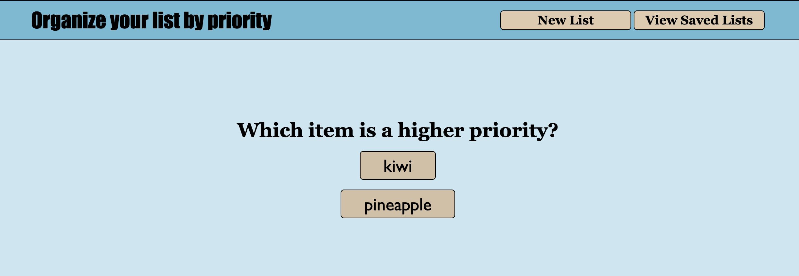
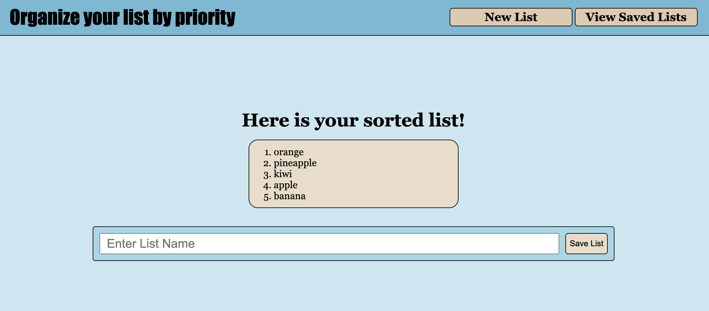
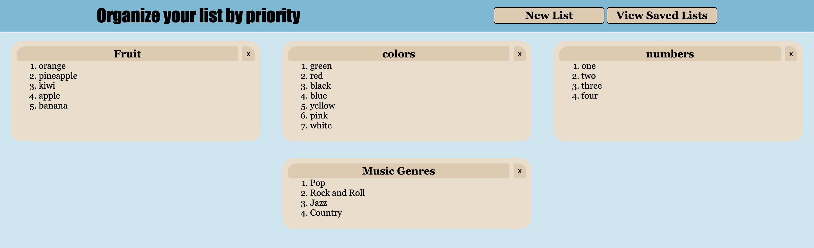

# Priority App 
  
## Description
  
Streamline your decision-making process with this unique app that empowers you to prioritize any list effortlessly. By systematically comparing each item against one another, the app unveils a clear and concise hierarchy, making it an invaluable tool when faced with challenging choices. Whether it's sorting tasks, ideas, or preferences, this app provides clarity, ensuring that what matters most to you takes center stage.

## Table of Contents

* [Usage](#usage) 
* [Contributing](#contributing) 
* [Contact Information](#contact-information) 
* [Credits](#credits) 
* [License](#license)

## Usage

Experience seamless list prioritization with the user-friendly interface of this web app. Here's how to maximize its features:  1. **Accessing the App:** Begin by visiting the app's site at https://benthere6.github.io/priority-web-app/. This is where you'll embark on your journey of efficient list organization.  2. **Creating a New List:** As you arrive, spot the 'New List' button and click it. This initiates the process of inputting the items you want to prioritize.  3. **Inputting Items:** Enter each item you wish to sort into the provided input field. The app eagerly awaits your input to construct a well-organized list.  4. **Sorting Process:** Once your list is ready, press the 'sort' button. The app will guide you through a series of prompts, prompting you to select which of the displayed items holds a higher priority. This iterative comparison process culminates in a meticulously sorted list.    5. **Enhanced Prioritization (Optional):** For a personalized touch, you have the option to assign a name to your list. After sorting, click 'save list' to store your list in local storage, ensuring its availability for future reference.    6. **Exploring Saved Lists:** Navigate to the 'View Saved Lists' option, conveniently located alongside 'New List.' By clicking on this, you can effortlessly access your saved lists, keeping track of your prioritization efforts over time.

## Contributing

I warmly invite fellow developers to join in enhancing the capabilities of this Priority App. Your valuable contributions can take several forms:  * **Addressing Issues:** Feel free to dive into the existing list of open issues and tackle any that resonate with you. Your insights and solutions are pivotal in refining the app's functionality and user experience. * **Suggesting Enhancements:** If you spot an aspect that you believe could be enhanced or have innovative ideas to elevate the app, don't hesitate to share your thoughts. Collaboration often ignites ingenious improvements. * **Pull Requests:** For those eager to make direct code contributions, I encourage you to fork this repository, create a new branch for your work, and then submit a pull request. Your pull request will be thoroughly reviewed to ensure its alignment with the app's goals and overall quality.  Your participation goes beyond mere code contributions. Your insightful feedback, proactive suggestions for enhancement, and active engagement in discussions are all crucial for propelling this project forward.  Thank you for considering contributing to the Priority App. Your dedication and expertise are instrumental in crafting an app that empowers users to make informed decisions effectively. Let's work together to create something exceptional.

## Contact Information

For any further inquiries, please feel free to reach out to me through the following channels:
* GitHub: [My GitHub Profile](https://www.github.com/BenThere6)
* Email: benjaminbirdsall@icloud.com

I am here to assist you with any questions or feedback you may have. Thank you for your interest!

## Credits

The Priority App has been diligently developed with originality and care by BenThere6. As the sole contributor to this project, I take pride in its creation and am committed to its ongoing improvement. While the app stands as a reflection of my work, I extend an open invitation for future contributors to join this collaborative journey and leave their mark. Your potential contributions are invaluable in further enhancing the app's capabilities and impact.

## License 

[MIT License](https://opensource.org/licenses/MIT)

The MIT License is a permissive open-source license that allows others to use, modify, and distribute your code for both commercial and non-commercial purposes. It requires that the original license notice and copyright notice are included in any redistributions.
